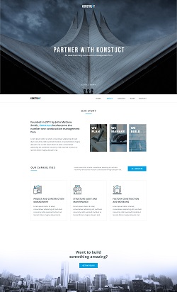

## Partner with Konstuct
### Одна из первых моих работ  на GitHub  

[GitHub Pages Partner with Konstuct](https://vsamura.github.io/Partner-with-Konstuct/)  

Реализована полная адаптивная версия под различные устройства.  

Интерактивные элементы планирую добавить с помощью JavaScript, по мере прохождения дальнейшего обучения и получения новых знаний.    

Данная работа сделана в ходе прохождения курса [*Frontend разработчик на HTML, CSS и JavaScript*](https://stepik.org/course/113402)  

## Связь со мной

